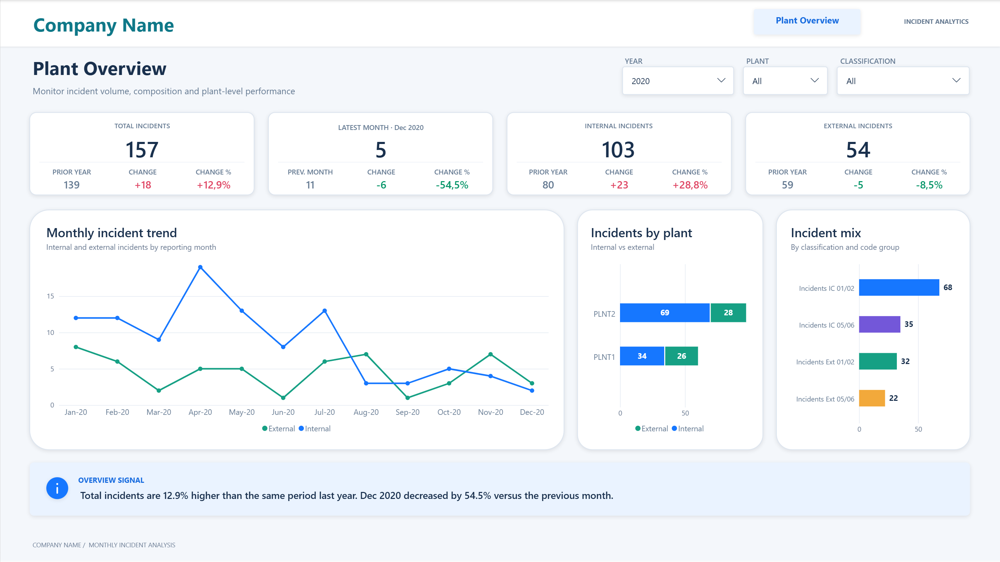
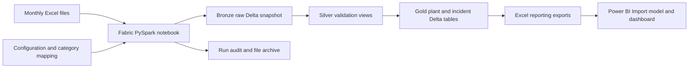

# Plant Incident Analytics Pipeline

**Monthly incident spreadsheets → validated Fabric lakehouse tables → Power BI.**

A complete portfolio project for a generic company: configuration-driven ingestion, PySpark and SQL transformations, Delta loading, reconciliation, run auditing and a Power BI incident dashboard.



## At a glance

| Business need | Engineering approach | Reporting outcome |
| --- | --- | --- |
| Consistent monthly incident reporting across plants | Configured Excel ingestion, category mapping and validation gates | Incident totals, internal/external trends and plant comparisons |
| Traceable, repeatable processing | Run lineage, Delta MERGE, reconciliation and file handling | A clear reporting handoff with inspectable data |

**Stack:** Microsoft Fabric · PySpark · Spark SQL · Delta Lake · Power BI · DAX · Power Query

The sample covers **2 plants, 24 months and 4 incident categories**. Its **48 spreadsheet rows become 192 fact rows**, containing **296 incidents**. These are sample results, not a claim of production impact.

## What this project demonstrates

- Building a configurable cloud ingestion workflow instead of hardcoding workbook layouts and table names.
- Turning wide spreadsheets into a consistent plant–month–category grain.
- Checking missing values, dates, non-negative whole counts, duplicate keys and category coverage before loading Gold.
- Inserting new records and updating changed values through Delta MERGE, then reconciling the loaded data.
- Recording processing stages, row counts and errors, with separate archive and failed-file folders.
- Modelling incident data and presenting totals, prior-year comparisons and latest-month signals in Power BI.

## Architecture



Silver uses temporary Spark views. The current report uses an explicit Excel export/import handoff; this package does not configure Direct Lake, orchestration or scheduled refresh.

## Explore the project

| Path | Contents |
| --- | --- |
| [`notebooks/incident_ingest.ipynb`](notebooks/incident_ingest.ipynb) | Fabric ingestion notebook and reporting export cell |
| [`configuration/incident_pipeline_config.xlsx`](configuration/incident_pipeline_config.xlsx) | Folder/table settings and category mappings |
| [`data/source/`](data/source/) | Monthly source workbook |
| [`data/reporting/`](data/reporting/) | Plant and incident reporting tables |
| [`powerbi/Plant Incident Analytics.pbip`](powerbi/Plant%20Incident%20Analytics.pbip) | Editable report, TMDL model, DAX measures and generic artwork |
| [`docs/setup.md`](docs/setup.md) | Fabric and Power BI walkthrough |
| [`docs/architecture.md`](docs/architecture.md) | Loading, recovery and reporting decisions |
| [`docs/data-contract.md`](docs/data-contract.md) | Input, output and metric definitions |
| [`docs/validation.md`](docs/validation.md) | Evidence, checks and execution scope |

## Open the report

Open `powerbi/Plant Incident Analytics.pbip` in Power BI Desktop, then select **Refresh**. The model contains an embedded copy of the generic reporting sample, so no account, database connection or machine-specific data path is required for this preview. A current Desktop version with PBIP and enhanced PBIR support is required; enable the relevant preview settings if your installation requires them.

To use the Excel exports, set the Power Query **DataFolder** parameter to the absolute path of `data/reporting` (or your downloaded Fabric exports) and refresh. Leave the parameter empty to return to the embedded sample. Source files, report layout, calculations and relationships remain editable.

## Run the Fabric pipeline

Create a schema-enabled Lakehouse, attach it as the notebook's default, upload the configuration workbook to `Files/configuration/` and the source workbook to `Files/data/`. Import the notebook and run all cells. The [setup guide](docs/setup.md) explains the outputs and reporting handoff.

## Verify locally

```bash
python -m pip install -r requirements-dev.txt
python scripts/validate_project.py
```

The checks compile notebook cells, validate configuration and sample grain, reconcile every exported fact row with its source, inspect report/model references and scan the package for private source metadata. GitHub Actions runs the same checks on pushes and pull requests. The Fabric notebook itself must run in Fabric.

## Add to GitHub

Create an empty GitHub repository named `plant-incident-analytics-pipeline`, then run these commands from this folder, replacing `YOUR_USERNAME`:

```bash
git init -b main
git add .
git commit -m "Add plant incident analytics pipeline portfolio project"
git remote add origin https://github.com/YOUR_USERNAME/plant-incident-analytics-pipeline.git
git push -u origin main
```

The project uses a generic company identity. Notebook execution outputs, original cloud connections and local Power BI caches are excluded. No licence has been assigned; choose one before inviting reuse.
